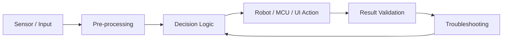

# Embedded SW QA Portfolio

> **센서 입력, 제어 로직, 하드웨어 동작, 결과 검증을 하나의 흐름으로 연결해 본 프로젝트 포트폴리오입니다.**

Embedded SW QA Engineer / 차량제어 SW 플랫폼 품질 점검 직무를 목표로, 임베디드 시스템·로봇 제어·비전 검사·시뮬레이션 프로젝트에서 수행한 **구현, 검증, 트러블슈팅 경험**을 정리했습니다.

---

## Featured Demos

### AMR Security System: 2대 TurtleBot 동시 추적


- ROS 2 / TurtleBot4 / Nav2 기반 순찰 및 추적 시스템
- 순찰 중 도난 좌표 수신 시 기존 goal cancel 후 추적 모드 전환
- 2대 TurtleBot이 동시에 target을 추적하도록 상태 전환 로직 구성

[자세히 보기](./projects/02_amr_security_system/README.md)

---

### Braille Robot Validation: 로봇팔 출력 결과 검증


- 로봇팔이 제작한 점자를 웹캠과 OpenCV로 검증
- 문자열 해석이 아닌 `expected cell sequence`와 `actual cell sequence` 비교로 pass/fail 판정
- ROI, 점 후보 검출, 줄 분리, 점자 칸 분리, 디버그 이미지 저장 구조 구현

[자세히 보기](./projects/03_braille_robot_validation/README.md)

---

### Isaac Sim Sorting: QR 기반 2대 로봇 물류 분류


- Isaac Sim 환경에서 QR 부착 박스를 출고일 기준으로 분류
- robot1은 today / not-today 1차 분류, robot2는 day2 / day3 2차 분류 담당
- QR decode 실패 fallback, box QR face-up, bbox overlap final gate 판정 구현

[자세히 보기](./projects/05_isaac_sim_sorting/README.md)

---

## Project Map

| No. | Project | Main Domain | Core Evidence | QA 관점 핵심 |
|---|---|---|---|---|
| 01 | [STM32 Embedded System](./projects/01_stm32_embedded_system/README.md) | Embedded C / MCU | `final_project.c` | GPIO, Timer, ADC/DMA, 입력 상태 전이 검증 |
| 02 | [AMR Security System](./projects/02_amr_security_system/README.md) | Robotics / ROS 2 | `real_final.py`, demo GIF | 순찰 중 예외 전환, goal cancel, 다중 로봇 추적 검증 |
| 03 | [Braille Robot Validation](./projects/03_braille_robot_validation/README.md) | Robot Vision / Validation | validation source, demo GIF | 실제 출력물을 영상 기반 점형 단위로 검증 |
| 04 | [Screw Defect Detection Dashboard](./projects/04_screw_defect_detection/README.md) | Vision Inspection / Web GUI | sanitized dashboard source, demo GIF | 검사 결과 정규화, 3D 시각화, 예외 상황 표시 |
| 05 | [Isaac Sim Sorting](./projects/05_isaac_sim_sorting/README.md) | Simulation / Multi-Robot | Isaac Sim source, package CSV, demo GIF | QR 인식, fallback, 2단계 분류, 도착 판정 검증 |

---

## Core Competencies

### Embedded SW
- STM32F103RB 기반 MCU 제어 경험
- GPIO, Timer, Interrupt, ADC, DMA, USART, NVIC 설정 경험
- Keypad 입력, Dot Matrix 출력, 온도 센서 데이터 처리 구현
- JTAG/AFIO pin conflict, 입력 bouncing, 하드웨어 결함 대응 경험

### Robotics & Sensor Integration
- ROS 2 / TurtleBot4 / Nav2 기반 AMR 순찰 및 추적 시스템 구현
- 로봇팔 기반 점자 제작 결과 검증 프로젝트 수행
- RealSense / 검사 결과를 Web GUI로 시각화하는 대시보드 구현
- Isaac Sim 기반 2대 로봇 물류 분류 시뮬레이션 구현

### SW QA / Validation
- 실제 동작 결과를 영상, 로그, JSON, debug image로 남기는 검증 구조 설계
- 센서 입력값과 로봇/MCU/UI 동작 결과 간 불일치 원인 분석
- fallback, timeout, goal cancel, bbox overlap 등 예외 조건 설계
- 단순 문자열/화면 표시보다 측정 가능한 기준으로 pass/fail 판정 정의

---

## Common Development Perspective



대부분의 프로젝트는 처음부터 완성된 구조가 아니라, 작은 기능 검증에서 시작해 실패 원인을 분리하고 다시 통합하는 방식으로 진행했습니다. 특히 **왜 실패했는지, 어떤 조건에서 재현되는지, 어떤 기준으로 성공을 판단할지**를 정리하는 데 집중했습니다.

---

## Repository Structure

```text
projects/
├── 01_stm32_embedded_system/       # Embedded C / MCU peripheral control
├── 02_amr_security_system/         # ROS 2 AMR patrol and chase system
├── 03_braille_robot_validation/    # Robot output validation with OpenCV
├── 04_screw_defect_detection/      # Inspection dashboard Web GUI
└── 05_isaac_sim_sorting/           # Isaac Sim multi-robot sorting simulation
```

각 프로젝트 폴더에는 다음 내용을 정리했습니다.

```text
README.md  : 프로젝트 개요, 개발 과정, 트러블슈팅, My Contribution, How to Read This Code
src/       : 최종 소스 코드 또는 공개 가능한 핵심 코드
media/     : 시연 GIF, 캡처 이미지
data/      : CSV 등 공개 가능한 입력 데이터
```

---

## Documents

- [Projects Overview](./projects/README.md)
- [Skill Summary](./docs/skill_summary.md)
- [Troubleshooting](./docs/troubleshooting.md)
- [Task Test Preparation](./docs/task_test_preparation.md)

---

## Contact

- GitHub: https://github.com/jiiiiihong
