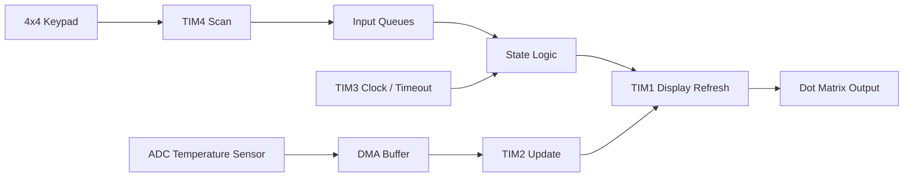

# STM32 Embedded System

## 한 줄 요약
STM32F103RB 보드에서 **Keypad 입력, Dot Matrix 출력, 온도 센서 측정, 시간 표시, 인증/잠금 상태 표시**를 통합한 레지스터 기반 임베디드 시스템입니다.

이 프로젝트의 핵심은 “기능을 만든 것”보다 **MCU 주변장치 설정과 실제 하드웨어 동작이 어긋나는 문제를 끝까지 추적했다는 점**입니다.

---

## 결과물

| 구분 | 내용 |
|---|---|
| 최종 코드 | [`src/final_project.c`](./src/final_project.c) |
| MCU | STM32F103RB / Cortex-M3 |
| 주요 주변장치 | GPIO, Timer, ADC, DMA, USART, NVIC, AFIO |
| 입출력 장치 | 4x4 Keypad, Dot Matrix, 온도 센서 |
| 강조 역량 | 레지스터 설정, 인터럽트 기반 제어, 하드웨어 트러블슈팅 |

---

## 시스템 구조

---

## 개발 과정

### 1. 기본 입출력 구성
처음에는 Keypad 입력값을 받아 Dot Matrix에 표시하는 구조부터 만들었습니다. 입력과 출력을 바로 연결하면 구현은 빨라지지만, 시간 설정, 인증 입력, 오류 표시가 추가될 때 상태가 쉽게 꼬일 수 있었습니다.

그래서 입력값을 바로 처리하지 않고 Queue에 저장한 뒤, 현재 모드에 따라 해석하도록 구조를 바꿨습니다.

### 2. Timer 역할 분리
하나의 Timer에 여러 기능을 몰아넣으면 표시 갱신, 시간 카운트, 입력 scan이 서로 영향을 줄 수 있었습니다. 최종적으로 Timer별 책임을 나눴습니다.

| Timer | 담당 기능 | 이유 |
|---|---|---|
| TIM1 | Dot Matrix refresh | 표시 갱신 주기를 독립적으로 유지 |
| TIM2 | 온도값 갱신 | ADC/DMA 결과를 일정 주기로 표시값으로 변환 |
| TIM3 | 시간 카운트 / timeout | 상태 전이와 표시 시간을 관리 |
| TIM4 | Keypad scan | 입력 감지와 debounce를 별도 관리 |

### 3. Queue 기반 상태 처리
Keypad는 하나지만 기능은 여러 개였습니다. 일반 입력, 시간 설정, 인증값 설정, 인증값 비교가 같은 입력 장치를 공유했습니다. 이를 분리하기 위해 용도별 Queue와 상태 flag를 만들었습니다.

| Queue | 역할 |
|---|---|
| `myQueue` | 일반 입력 표시 |
| `time_set_que` | 시간 설정 입력 저장 |
| `passcode_que` | 인증값 설정 데이터 저장 |
| `my_passcode_que` | 사용자가 입력한 인증값 저장 |
| `r_data_que` | USART 수신 데이터 저장 |

---

## 어려웠던 점과 해결 방식

### 1. PB3/PB4가 GPIO처럼 동작하지 않음
**문제**  
Keypad 입력 일부가 정상적으로 들어오지 않았습니다. 코드상 row/column 설정은 맞아 보였지만 특정 핀만 계속 반응하지 않았습니다.

**원인 분석**  
STM32F103RB에서 PB3/PB4는 기본적으로 JTAG 기능에 연결되어 있어 일반 GPIO로 바로 사용할 수 없었습니다.

**해결**  
AFIO remap 설정으로 JTAG 기능을 비활성화하고 GPIO 입력으로 사용할 수 있게 했습니다.

**배운 점**  
임베디드 디버깅에서는 코드보다 먼저 **핀의 기본 기능, alternate function, remap 여부**를 확인해야 합니다.

---

### 2. Dot Matrix 일부 핀 불량
**문제**  
8x16 Dot Matrix 전체 출력이 정상적으로 표시되지 않았습니다.

**원인 분석**  
코드 문제가 아니라 실습 장비의 일부 핀이 물리적으로 정상 동작하지 않는 상황이었습니다.

**해결**  
표시 범위를 8x16에서 8x15 형태로 우회하고, 정상 동작하는 핀 기준으로 font table과 출력 흐름을 조정했습니다.

**배운 점**  
하드웨어 제약이 생겼을 때 기능을 포기하는 것이 아니라, 요구 기능을 만족하는 대체 구조를 설계해야 합니다.

---

### 3. Keypad bouncing과 상태 충돌
**문제**  
한 번 누른 키가 여러 번 입력되거나, 시간 설정과 인증 설정 상태가 섞이는 문제가 발생할 수 있었습니다.

**해결**  
입력 scan 후 짧은 지연을 두고, 기능별 Queue와 상태 flag를 분리했습니다. 또한 timeout 조건을 두어 입력이 중간에 끊긴 경우 상태가 초기화되도록 했습니다.

**배운 점**  
입력 장치를 여러 기능이 공유하는 시스템에서는 **상태 전이표**를 먼저 세우고 구현해야 디버깅이 쉬워집니다.

---

## QA 관점 정리

| 검증 대상 | 발생 가능 문제 | 대응 방식 |
|---|---|---|
| GPIO 입력 | JTAG/AFIO 충돌 | remap 설정 확인 |
| Keypad scan | bouncing / 중복 입력 | scan delay, Queue 관리 |
| Dot Matrix | 핀 불량 / 출력 깨짐 | 8x15 우회 출력 |
| ADC 표시 | 갱신 타이밍 흔들림 | DMA 취득과 표시 갱신 분리 |
| 상태 전이 | 모드 충돌 | Queue와 flag 분리 |

---

## 직무 연결 포인트
Embedded SW QA 직무에서 중요한 것은 코드가 컴파일되는지가 아니라 **실제 하드웨어에서 의도대로 동작하는지 검증하는 능력**이라고 생각합니다. 이 프로젝트에서는 핀 기능 충돌, 입력 bouncing, 표시 장치 결함처럼 실제 장비에서 발생하는 문제를 원인별로 분리해 해결했습니다.
