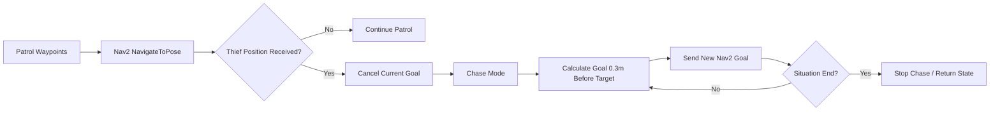
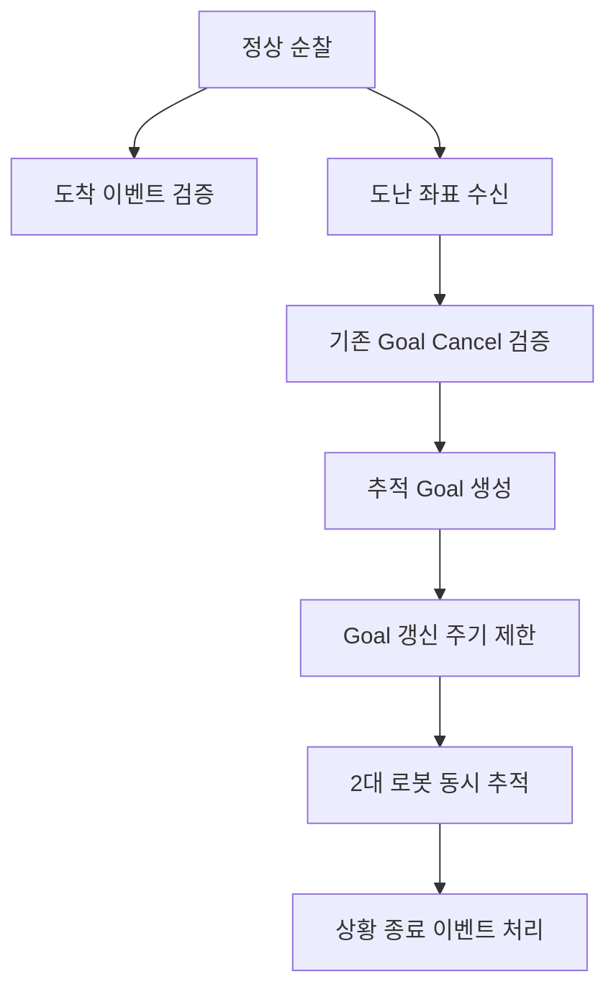

# AMR Security System

## 한 줄 요약
박물관 환경에서 AMR이 순찰을 수행하다가 도난 상황이 발생하면 **2대의 TurtleBot이 동시에 추적 모드로 전환**되도록 구성한 ROS 2 기반 로봇 시스템입니다.

핵심은 단순 주행이 아니라, **정상 순찰 → 이벤트 수신 → 기존 goal 취소 → 추적 goal 갱신 → 상황 종료 복귀**까지 상태 전환을 안정적으로 만든 점입니다.

---

## 시연


---

## 결과물

| 구분 | 내용 |
|---|---|
| 최종 코드 | [`src/real_final.py`](./src/real_final.py) |
| 시연 자료 | [`media/amr_patrol_tracking_dual.gif`](./media/amr_patrol_tracking_dual.gif) |
| 주요 기술 | ROS 2, TurtleBot4, Nav2, AMCL, Topic, Action |
| 핵심 기능 | 교대 순찰, 도착 이벤트 발행, 도난 좌표 수신, 2대 동시 추적 |

---

## 시스템 구조



---

## 개발 과정

### 1. 단일 로봇 순찰 구현
먼저 지정된 waypoint를 따라 이동하는 순찰 루프를 구성했습니다. 이 단계에서는 Nav2 goal을 순차적으로 보내고, 도착 여부를 확인하는 기본 구조를 만들었습니다.

### 2. 도착 이벤트 발행
순찰 중 특정 위치에 도착했을 때 외부 시스템이 알 수 있도록 `/robot8/arrive_position` 토픽을 발행했습니다.

| 위치 | 의미 | 발행값 |
|---|---|---|
| pot 근처 | 전시물 1 도착 | `1` |
| ball 근처 | 전시물 2 도착 | `2` |

### 3. 교대 순찰 구조 추가
한 로봇의 순찰이 끝나면 다른 로봇이 이어서 순찰할 수 있도록 `start_patrol_signal`을 발행했습니다. 단일 발행은 유실 가능성이 있어 여러 번 반복 발행하도록 구성했습니다.

### 4. 추적 모드 추가
도둑 좌표가 들어오면 기존 순찰 goal을 취소하고, 추적 모드로 전환했습니다. 로봇이 도둑 위치 바로 위로 돌진하지 않도록, 도둑 좌표보다 0.3m 앞 지점을 목표로 설정했습니다.

```text
robot position = 현재 AMCL 위치
thief position = 외부에서 수신한 도둑 좌표
goal = thief position - unit vector(robot → thief) × 0.30m
```

### 5. 2대 동시 추적 안정화
두 로봇이 동시에 추적할 때는 각 로봇의 goal 갱신, cancel, 상태 flag가 겹치지 않도록 관리해야 했습니다. 이를 위해 상태 flag를 분리했습니다.

| State flag | 역할 |
|---|---|
| `chase_requested` | 추적 요청 수신 여부 |
| `chase_mode` | 실제 추적 동작 중인지 여부 |
| `chase_transitioning` | 순찰에서 추적으로 넘어가는 중복 전환 방지 |

---

## 어려웠던 점과 해결 방식

### 1. AMCL 초기 위치가 가끔 반영되지 않음
**문제**  
초기 위치를 발행했는데도 로봇 위치가 제대로 잡히지 않아 순찰 시작이 불안정했습니다.

**원인 분석**  
AMCL node 또는 subscriber가 준비되기 전에 initial pose를 1회만 발행하면 메시지가 유실될 수 있었습니다.

**해결**  
AMCL 활성화 여부와 subscriber count를 확인한 뒤 initial pose를 발행하도록 했고, `RELIABLE + TRANSIENT_LOCAL` QoS를 적용했습니다.

**결과**  
순찰 시작 전 localization 안정성이 올라갔습니다.

---

### 2. 순찰 중 도난 상황이 들어오면 기존 goal과 충돌
**문제**  
waypoint로 이동 중 도둑 좌표가 들어오면 로봇이 기존 순찰 goal을 계속 따라가 추적 반응이 늦어질 수 있었습니다.

**해결**  
순찰 완료 대기 루프 내부에서 `chase_requested`를 계속 감시했고, 추적 요청이 들어오면 `cancelTask()`로 기존 goal을 취소했습니다.

**결과**  
순찰보다 도난 추적이 우선되는 구조가 되었습니다.

---

### 3. 추적 goal이 너무 자주 갱신됨
**문제**  
도둑 좌표가 거의 변하지 않았는데도 매 주기마다 goal을 다시 보내면 Nav2 action server가 불필요하게 바빠지고 로봇 움직임이 흔들릴 수 있었습니다.

**해결**  
직전 goal과 새 goal의 거리가 `0.05m` 미만이면 갱신을 생략했습니다.

**결과**  
추적 동작이 더 안정적이고 자연스러워졌습니다.

---

### 4. 교대 순찰 시작 신호 유실 가능성
**문제**  
다른 로봇에게 순찰 시작 신호를 한 번만 보내면, 상대 노드가 준비되지 않았을 때 신호를 놓칠 수 있었습니다.

**해결**  
순찰 완료 후 `start_patrol_signal=True`를 여러 번 반복 발행했습니다.

**결과**  
다중 로봇 협업에서 통신 타이밍으로 인한 실패 가능성을 줄였습니다.

---

## QA 관점 정리



| 검증 대상 | 위험 요소 | 적용한 대응 |
|---|---|---|
| 초기 위치 | AMCL pose 미반영 | QoS와 subscriber 준비 확인 |
| 순찰 중 추적 전환 | 기존 goal 잔류 | `cancelTask()` 적용 |
| 추적 goal | 과도한 goal 갱신 | 0.05m threshold 적용 |
| 교대 순찰 | topic 유실 | 반복 발행 |
| 2대 동시 추적 | 상태 충돌 | 상태 flag 분리 |

---

## 직무 연결 포인트
이 프로젝트는 Embedded SW QA 관점에서 **정상 상태보다 예외 상태 전환을 어떻게 검증했는가**를 보여줍니다. 특히 ROS 2 메시지 유실, action goal 취소, 다중 로봇 상태 충돌 같은 실제 시스템형 문제를 해결한 경험이 강점입니다.
