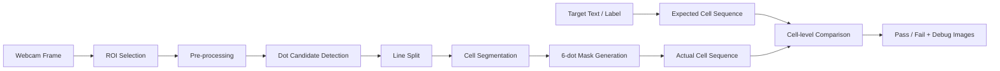

# Braille Robot Validation

## 한 줄 요약
로봇팔이 제작한 점자를 웹캠으로 촬영하고, OpenCV 기반 영상 처리로 **실제 점형이 목표 점형과 일치하는지 검증**한 프로젝트입니다.

이 프로젝트의 핵심은 글자 해석을 억지로 맞추는 것이 아니라, 검증 기준을 **문자열이 아닌 점형 cell sequence**로 재정의한 점입니다.

---

## 시연


---

## 결과물

| 구분 | 내용 |
|---|---|
| 최종 코드 | [`src/dot_validation_final_generalized_cells_v3_slopefix.py`](./src/dot_validation_final_generalized_cells_v3_slopefix.py) |
| 시연 자료 | [`media/braille_robot_validation_late.gif`](./media/braille_robot_validation_late.gif) |
| 주요 기술 | Python, OpenCV, NumPy, Webcam Capture, ROI, Contour Detection |
| 핵심 기능 | ROI 선택, 점 후보 검출, 줄 분리, 점자 칸 분리, expected/actual 점형 비교 |

---

## 시스템 구조



---

## 개발 과정

### 1. 촬영 영역 고정
처음에는 전체 프레임에서 점자를 찾으려고 했지만, 배경 노이즈와 조명 반사 때문에 안정적인 검출이 어려웠습니다. 그래서 사용자가 마우스로 점자 영역을 직접 선택하는 ROI 기반 구조로 바꿨습니다.

### 2. 점 후보 검출
점자는 작고 반사 조건에 민감합니다. 단순 threshold만 쓰면 점이 사라지거나 여러 조각으로 쪼개졌습니다. 이를 보완하기 위해 blur, local peak 강조, threshold, morphology, contour filtering을 조합했습니다.

### 3. 줄 단위 분리
여러 줄 점자를 처리하기 위해 전체 ROI에서 점 후보를 먼저 찾고, y좌표 분포를 기준으로 줄을 나눴습니다. 줄별 threshold를 새로 계산하면 약한 점이 누락될 수 있어, 전체 ROI 기준 `base_binary`를 만든 뒤 줄 box로 crop하는 방식으로 개선했습니다.

### 4. 점자 칸 분리
처음부터 글자를 해석하지 않고, x좌표 기준으로 column을 만들고 column 간격을 이용해 점자 칸을 분리했습니다. 각 칸은 왼쪽/오른쪽 column과 row 위치를 기준으로 6점 mask로 변환했습니다.

### 5. 최종 판정 기준 변경
한글 점자는 약자, 받침, 조합 규칙 때문에 문자열 해석 후보가 여러 개 생길 수 있습니다. 그래서 최종 pass/fail은 문자열이 아니라 **expected cell sequence와 actual cell sequence의 일치 여부**로 판단했습니다.

---

## 어려웠던 점과 해결 방식

### 1. 점 하나가 여러 contour로 쪼개짐
**문제**  
점자 한 점이 여러 조각으로 검출되어 실제보다 많은 점이 있는 것처럼 보였습니다.

**원인 분석**  
조명, threshold, local peak 강조가 강할 때 하나의 emboss 영역이 여러 contour로 분리되었습니다.

**해결**  
가까운 점 후보를 병합하는 merge 파라미터를 두고, median blur와 morphology close를 조절할 수 있게 했습니다.

**결과**  
촬영 조건이 달라져도 점 후보를 병합/분리하며 검출 민감도를 조정할 수 있었습니다.

---

### 2. 여러 점이 하나의 큰 blob으로 붙음
**문제**  
조명이 강하거나 표면 반사가 있으면 한 칸의 여러 점이 하나의 큰 blob으로 잡혔습니다.

**해결**  
넓은 밝은 영역을 그대로 쓰지 않고 local peak 중심으로 후보를 남기도록 했습니다.

**결과**  
붙어 있는 emboss 영역 안에서도 개별 점 중심을 더 안정적으로 분리할 수 있었습니다.

---

### 3. 줄별 threshold 때문에 약한 점 누락
**문제**  
여러 줄 점자에서 특정 줄의 약한 점이 사라졌습니다.

**원인 분석**  
줄마다 threshold를 다시 계산하면 기준이 바뀌어 같은 밝기의 점도 어떤 줄에서는 검출되고 어떤 줄에서는 누락되었습니다.

**해결**  
전체 ROI 기준으로 `base_binary`를 만든 뒤 line box로 crop하여 모든 줄에 동일한 판정 기준을 적용했습니다.

**결과**  
줄마다 검출 기준이 흔들리는 문제를 줄였습니다.

---

### 4. 기울기 보정이 오히려 오판을 만듦
**문제**  
촬영이 약간 기울어진 경우 row slope 보정을 넣었지만, 과한 보정이 실제 점 위치를 왜곡해 row 판단을 틀리게 만들 수 있었습니다.

**해결**  
큰 기울기 보정보다 촬영 가이드라인을 맞추는 방향으로 설계를 바꾸고, slope 보정 범위를 제한했습니다.

**결과**  
행 모델이 과하게 회전해 점형이 틀어지는 문제를 줄였습니다.

---

### 5. 문자열 해석은 맞아 보이지만 점형은 틀림
**문제**  
문자열 후보만 보면 맞는 것처럼 보일 수 있지만, 실제 로봇이 찍은 점형은 목표와 다를 수 있었습니다.

**해결**  
최종 검증 기준을 문자열 비교가 아닌 cell code sequence 비교로 변경했습니다.

```text
expected_cells == actual_cells  → PASS
expected_cells != actual_cells  → FAIL
```

**결과**  
“읽히는가”가 아니라 “목표 점형이 실제로 제작되었는가”를 검증할 수 있게 되었습니다.

---

## QA 관점 정리

| 검증 단계 | 위험 요소 | 대응 |
|---|---|---|
| 촬영 | 배경 노이즈, ROI 흔들림 | 사용자 ROI 선택, 가이드라인 |
| 점 검출 | 분리/병합 오류 | local peak, contour filtering, merge 파라미터 |
| 줄 분리 | 줄별 threshold 차이 | base binary 공유 |
| 점형 생성 | row/column 오판 | column gap 기반 cell segmentation |
| 최종 판정 | 문자열 다중 해석 | cell sequence 비교 |

---

## 직무 연결 포인트
이 프로젝트는 Embedded SW QA 관점에서 **출력 결과를 다시 센서로 읽어 검증하는 closed-loop 구조**를 보여줍니다. 특히 검증 기준을 문자 해석에서 점형 단위로 바꾼 점은, 실제 품질 검증에서 “무엇을 pass/fail 기준으로 볼 것인가”를 정의한 경험으로 연결됩니다.
