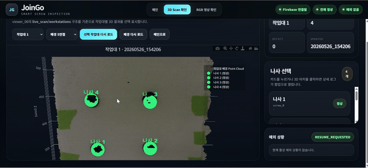
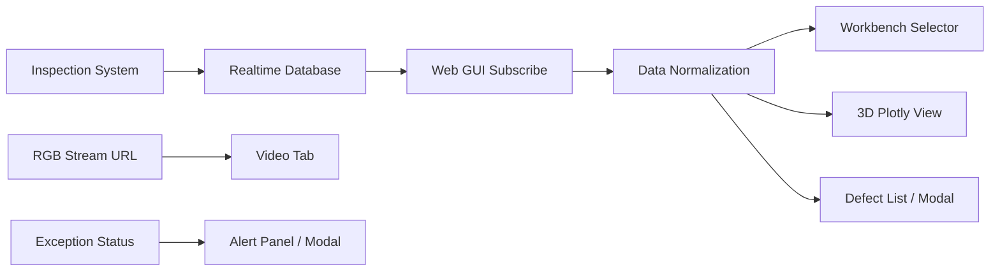

# Screw Defect Detection Dashboard

## 한 줄 요약
나사 체결 검사 결과를 Firebase Realtime Database에서 받아와 **작업대별 정상/불량 상태를 3D 대시보드로 시각화**한 Web GUI 프로젝트입니다.

이 프로젝트에서 저는 전체 시스템 중 **검사 결과를 사용자가 이해하고 조치할 수 있게 만드는 Web GUI 영역**을 담당했습니다. 핵심은 단순 화면 구현이 아니라, 검사 데이터의 구조가 달라져도 UI가 깨지지 않도록 정규화 계층을 만든 점입니다.

---

## 시연



---

## 결과물

| 구분 | 내용 |
|---|---|
| 공개용 코드 | [`src/joingo_modern_tab_dashboard_v6_ko_vr_sanitized.html`](./src/joingo_modern_tab_dashboard_v6_ko_vr_sanitized.html) |
| 시연 자료 | [`media/screw_dashboard.gif`](./media/screw_dashboard.gif) |
| 주요 기술 | HTML, CSS, JavaScript, Firebase Realtime Database, Plotly, Three.js 협업 구조 |
| 담당 영역 | Web GUI, 검사 결과 시각화, 작업대 선택 UI, 예외 상황 표시 |

---

## 시스템 구조



---

## 개발 과정

### 1. 검사 결과 수신 구조 설계
처음에는 검사 결과가 일정한 형태로 들어온다고 가정하고 UI를 만들 수 있었습니다. 하지만 실제 프로젝트에서는 작업대별 데이터, 나사 목록, 좌표, 상태값이 여러 형태로 들어올 수 있었습니다.

그래서 화면에 바로 뿌리는 대신, 먼저 데이터 정규화 함수를 통해 내부 표준 구조로 바꾸는 과정을 추가했습니다.

### 2. 작업대별 데이터 선택
여러 작업대의 검사 결과가 동시에 들어올 수 있으므로, `live_scan/workstations`를 구독하고 작업대 key를 dropdown으로 표시했습니다. 사용자가 작업대를 선택하면 해당 작업대의 나사 상태와 3D 시각화가 갱신되도록 구성했습니다.

### 3. 3D 시각화 구현
나사 좌표와 배경 point cloud를 Plotly 3D scatter로 표현했습니다. 정상과 불량 상태를 색으로 구분하고, marker를 클릭하면 상세 정보를 modal로 확인할 수 있게 했습니다.

### 4. 불량 상세 확인 및 조치
불량 나사를 클릭하면 ID, 좌표, frame, 원본 로그를 modal로 보여줬습니다. 조치 완료 버튼을 누르면 DB의 해당 status를 정상으로 바꾸는 흐름을 구성했습니다.

### 5. 예외 상황 UI 추가
단순 검사 결과뿐 아니라 비상정지, 일시정지, 안전정지 같은 예외 상태도 사용자에게 명확히 보여줘야 했습니다. 이를 위해 별도 예외 panel과 modal을 구성했습니다.

---

## 어려웠던 점과 해결 방식

### 1. 검사 데이터 구조가 일정하지 않음
**문제**  
검사 결과가 배열로 들어오기도 하고, 객체로 들어오기도 하며, `screws`, `markers` 등 다른 key를 사용할 가능성이 있었습니다.

**해결**  
`normalizeScrews()`와 `normalizeScrew()` 함수를 만들어 입력 형태를 내부 표준 구조로 바꿨습니다.

**결과**  
상위 검사 시스템의 데이터 표현이 조금 달라져도 UI가 쉽게 깨지지 않는 구조가 되었습니다.

---

### 2. 정상/불량 상태 표현이 제각각임
**문제**  
검사 결과가 `normal`, `ok`, `pass`, `ng`, `error`처럼 여러 표현으로 들어올 수 있었습니다.

**해결**  
UI 내부에서는 모든 상태를 `normal` 또는 `defect`로 통합했습니다.

```text
normal 계열 → normal
defect 계열 → defect
```

**결과**  
화면 표시, 통계, modal 처리에서 일관된 판정 기준을 사용할 수 있었습니다.

---

### 3. Point Cloud 렌더링이 무거움
**문제**  
배경 point cloud를 그대로 표시하면 브라우저 렌더링 부하가 커졌습니다.

**해결**  
point 개수 제한을 두고 step sampling을 적용했습니다. 사용자가 point limit을 조절할 수 있도록 해, 품질과 속도 사이에서 선택할 수 있게 했습니다.

**결과**  
3D 배경을 유지하면서도 브라우저가 멈추지 않도록 부담을 줄였습니다.

---

### 4. 데이터가 없을 때 실패처럼 보임
**문제**  
DB에 아직 검사 결과가 없는 상태와 실제 오류 상태가 화면상 구분되지 않았습니다.

**해결**  
데이터가 없는 경우 overlay와 placeholder를 표시해 “데이터 대기 상태”임을 보여줬습니다.

**결과**  
사용자가 연결 실패와 데이터 부재를 구분할 수 있게 되었습니다.

---

### 5. 공개 저장소에 원본 설정값을 그대로 올릴 수 없음
**문제**  
원본 HTML에는 외부 서비스 연결 설정값이 포함되어 있어 공개 저장소에 그대로 올리기 어려웠습니다.

**해결**  
공개용 파일은 설정값을 제거한 sanitized 버전으로 관리했습니다. 구현 구조와 UI 로직은 보이되, 프로젝트 연결 정보는 노출되지 않도록 했습니다.

**결과**  
채용용 포트폴리오에서 구현 역량은 보여주고, 공개 저장소의 불필요한 노출 위험은 줄였습니다.

---

## QA 관점 정리

| 검증 대상 | 위험 요소 | 대응 |
|---|---|---|
| 데이터 입력 | schema 변화 | normalize 계층 구성 |
| 상태 표시 | 표현 불일치 | normal/defect 기준 통합 |
| 3D 렌더링 | point cloud 부하 | sampling / limit 적용 |
| 빈 데이터 | 오류처럼 보임 | placeholder / overlay 표시 |
| 공개 저장소 | 설정값 노출 | sanitized source 관리 |

---

## 직무 연결 포인트
이 프로젝트는 검사 장비가 만들어낸 데이터를 사용자가 판단 가능한 형태로 바꾸는 경험입니다. Embedded SW QA 관점에서는 **검사 결과를 안정적으로 수집하고, 일관된 기준으로 정규화하고, 사람이 조치 가능한 형태로 시각화하는 능력**과 연결됩니다.
