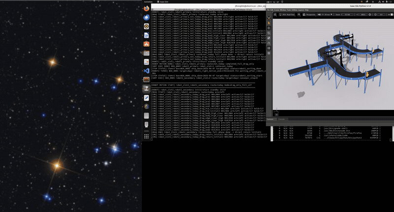
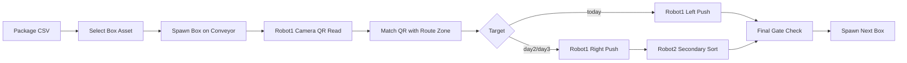

# Isaac Sim Sorting Simulation

## 한 줄 요약
NVIDIA Isaac Sim 환경에서 QR 코드가 부착된 박스를 컨베이어로 공급하고, **2대의 로봇이 출고일 기준으로 물류 박스를 분류**하는 시뮬레이션을 구현했습니다.

핵심은 단일 로봇 동작에서 끝내지 않고, **QR 인식 → CSV 라우팅 → 1차 분류 → 2차 분류 → 최종 도착 판정**까지 물류 흐름을 단계별로 통합한 점입니다.

---

## 시연



---

## 결과물

| 구분 | 내용 |
|---|---|
| 최종 코드 | [`src/Step4_Stage1_01_finalfac1_two_robot_sort_v17.py`](./src/Step4_Stage1_01_finalfac1_two_robot_sort_v17.py) |
| 입력 데이터 | [`data/packages_2026-06-08.csv`](./data/packages_2026-06-08.csv), [`data/packages_2026-06-09.csv`](./data/packages_2026-06-09.csv), [`data/packages_2026-06-10.csv`](./data/packages_2026-06-10.csv) |
| 시연 자료 | [`media/isaac_sim_sorting.gif`](./media/isaac_sim_sorting.gif) |
| 주요 기술 | Isaac Sim, Python, USD, OpenCV QRCodeDetector, CSV Routing, Multi-Robot Control |
| 핵심 기능 | QR 인식, route zone 매칭, 2대 로봇 분류, final gate 판정 |

---

## 시스템 구조



---

## 개발 과정

### 1. 단일 로봇 분류 동작 검증
처음에는 QR 인식이나 CSV 라우팅을 붙이기 전에, 로봇이 박스를 밀어 분류할 수 있는지부터 검증했습니다. 이 단계에서 로봇팔 동작 범위, 박스 충돌체, 컨베이어 위 위치를 맞췄습니다.

### 2. QR 부착 박스 흐름 구성
box asset 내부에 이미 QR 이미지가 포함되어 있었기 때문에, 별도 QR plane을 새로 붙이는 방식보다 asset에 포함된 QR을 활용하는 방식으로 정리했습니다. 이후 QR이 카메라에 보이도록 박스 회전 방향을 고정했습니다.

### 3. CSV 기반 라우팅 추가
`package_id`, `qr_id`, `route_zone`이 포함된 CSV를 읽어 QR payload와 route zone을 매칭했습니다. route zone에 따라 `today`, `day2`, `day3` target을 결정했습니다.

### 4. 2대 로봇 역할 분리
robot1은 1차 분류를 담당하고, robot2는 today가 아닌 박스를 day2/day3로 2차 분류하도록 구성했습니다.

| Robot | 역할 |
|---|---|
| robot1 | QR 판정 후 today / not-today 1차 분류 |
| robot2 | day2 / day3 최종 분류 |

### 5. 최종 도착 판정 개선
초기에는 박스 중심점이 final gate 내부에 들어와야 성공으로 판단했습니다. 하지만 실제 컨베이어 흐름에서는 박스가 영역에 걸치거나 지나가도 분류 성공으로 봐야 했습니다. 그래서 중심점 판정을 bbox overlap 판정으로 변경했습니다.

---

## 어려웠던 점과 해결 방식

### 1. QR이 카메라에 보이지 않음
**문제**  
박스에 QR이 있는데도 robot1 상단 카메라에서 QR이 보이지 않는 경우가 있었습니다.

**원인 분석**  
asset 내부에서 QR이 붙은 면은 local `-Y`였고, 박스 스폰 방향이 이를 고려하지 않아 QR 없는 면이 위로 올라오는 경우가 있었습니다.

**해결**  
QR face test를 통해 QR 면 방향을 확인하고, `force_box_qr_face_up()`으로 local `-Y` 면이 위를 향하도록 회전값을 강제했습니다.

**결과**  
robot1 상단 카메라에서 QR이 보이는 방향으로 박스가 안정적으로 스폰되었습니다.

---

### 2. 실제 QR decode가 실패하면 전체 시나리오가 멈춤
**문제**  
카메라 해상도, 조명, QR 크기, 카메라 위치에 따라 OpenCV QR decode가 실패할 수 있었습니다.

**해결**  
실제 카메라 decode를 1순위로 사용하되, 실패 시 box prim에 저장된 `user:qr_payload` 값을 fallback으로 사용했습니다. 동시에 debug image를 저장해 실제 decode 실패 원인을 확인할 수 있게 했습니다.

```text
camera decode 성공 → decoded payload 사용
camera decode 실패 → user:qr_payload fallback
```

**결과**  
QR 인식 검증은 유지하면서도 전체 물류 시나리오가 중간에 멈추지 않도록 했습니다.

---

### 3. 박스가 목적지에 도달했는데 실패로 판정됨
**문제**  
박스가 final gate 영역을 지나갔는데도 다음 박스가 스폰되지 않는 문제가 있었습니다.

**원인 분석**  
성공 조건이 박스 중심점 기준이었기 때문에, 박스가 영역에 걸치거나 통과했지만 중심점이 내부에 없으면 실패로 처리되었습니다.

**해결**  
박스 bounding box와 final gate bounding box가 겹치면 성공으로 보는 bbox overlap 방식으로 바꿨습니다.

**결과**  
컨베이어 분류 동작에 더 맞는 성공 판정을 만들 수 있었습니다.

---

### 4. robot2가 처리하지 않아야 할 박스까지 반응할 가능성
**문제**  
today 박스는 robot1에서 끝나야 하는데, 단순 순차 구조에서는 robot2 단계로 넘어갈 가능성이 있었습니다.

**해결**  
target이 `today`인 경우 robot2를 건너뛰고 final gate만 확인하도록 분기했습니다. `day2`, `day3`일 때만 robot2가 동작하도록 역할을 분리했습니다.

**결과**  
두 로봇의 책임이 명확해지고, 분류 흐름이 실제 요구사항에 맞게 정리되었습니다.

---

### 5. 큰 박스 asset이 로봇 동작을 방해함
**문제**  
일부 box asset은 시각적 크기와 충돌체가 커서 로봇팔과 충돌하거나 분류 동작이 불안정해질 수 있었습니다.

**해결**  
시각 asset은 유지하되 충돌체는 낮은 proxy collider로 대체했습니다. 또한 gripper가 박스 모서리에 걸리지 않도록 proxy scale을 조정했습니다.

**결과**  
시각적으로는 박스를 유지하면서 물리 충돌로 인한 동작 실패를 줄였습니다.

---

## QA 관점 정리

| 검증 대상 | 위험 요소 | 대응 |
|---|---|---|
| QR 인식 | 면 방향 / 조명 / 해상도 문제 | QR face-up 강제, debug image 저장 |
| 라우팅 | CSV와 QR payload 불일치 | route mapping, fallback 처리 |
| 로봇 분류 | robot1/robot2 역할 혼선 | target별 분기 명확화 |
| 도착 판정 | 중심점 기준 false negative | bbox overlap 방식 적용 |
| 물리 동작 | 충돌체로 인한 불안정 | proxy collider 적용 |

---

## 개발 단계 차트

```mermaid
gantt
    title Isaac Sim Sorting Development Flow
    dateFormat  X
    axisFormat  %s
    section Step
    Single robot push test       :done, 0, 1
    QR box orientation test      :done, 1, 1
    Camera QR decode / fallback  :done, 2, 1
    CSV route matching           :done, 3, 1
    Robot1 primary sorting       :done, 4, 1
    Robot2 secondary sorting     :done, 5, 1
    Final gate bbox validation   :done, 6, 1
```



---

## 직무 연결 포인트
이 프로젝트는 Embedded SW QA 관점에서 **센서 입력과 제어 결과가 실제 요구사항대로 연결되는지 검증한 경험**입니다. QR decode 실패, 박스 방향, 도착 판정, 다중 로봇 역할 분기처럼 통합 단계에서 발생하는 문제를 기능별로 분리하고 안정화했습니다.
