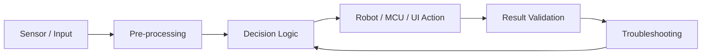
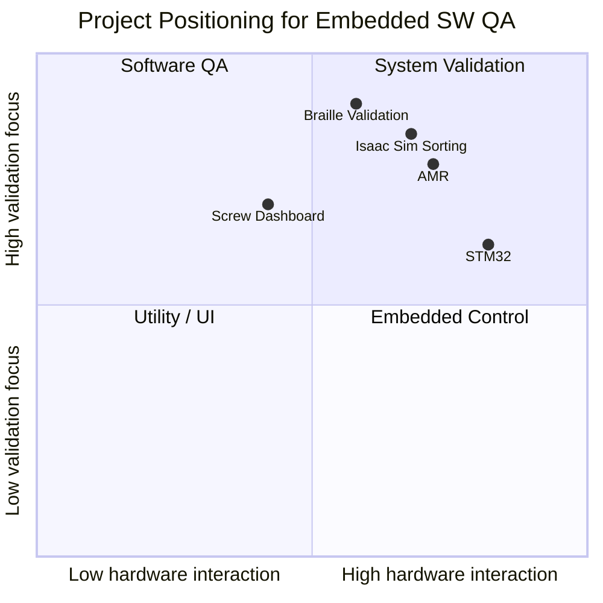

# Projects Overview

이 디렉터리는 Embedded SW QA / 차량제어 SW 품질 직무에 연결될 수 있는 프로젝트를 모아 정리한 공간입니다.

---

## 전체 프로젝트 맵

| No. | Project | Main Domain | Core Evidence | QA 관점 핵심 |
|---|---|---|---|---|
| 01 | [STM32 Embedded System](./01_stm32_embedded_system/README.md) | Embedded C / MCU | `src/final_project.c` | GPIO, Timer, ADC/DMA, 입력 상태 전이 검증 |
| 02 | [AMR Security System](./02_amr_security_system/README.md) | Robotics / ROS 2 | `src/real_final.py`, demo GIF | 순찰 중 예외 전환, goal cancel, 다중 로봇 추적 검증 |
| 03 | [Braille Robot Validation](./03_braille_robot_validation/README.md) | Robot Vision / Validation | `src/dot_validation...py`, demo GIF | 실제 출력물을 영상 기반 점형 단위로 검증 |
| 04 | [Screw Defect Detection](./04_screw_defect_detection/README.md) | Vision Inspection / Web GUI | sanitized dashboard source, demo GIF | 검사 결과 정규화, 3D 시각화, 예외 상황 표시 |
| 05 | [Isaac Sim Sorting](./05_isaac_sim_sorting/README.md) | Simulation / Multi-Robot | Isaac Sim final source, package CSV, demo GIF | QR 인식, fallback, 2단계 분류, 도착 판정 검증 |

---

## 공통 개발 관점



대부분의 프로젝트는 처음부터 완성된 구조로 구현된 것이 아니라, 작은 기능 검증에서 시작해 실패 원인을 분리하고 다시 통합하는 방식으로 진행했습니다. 이 과정에서 단순히 “동작했다”가 아니라 **왜 실패했는지, 어떤 조건에서 다시 재현되는지, 어떤 기준으로 성공을 판단할지**를 정리하는 데 집중했습니다.

---

## 프로젝트별 강조 포인트



- **STM32**: 주변장치 제어와 실제 하드웨어 동작 불일치 해결 경험
- **AMR**: 순찰/추적 상태 전환과 다중 로봇 협업 시나리오 안정화 경험
- **점자 검증**: 로봇 출력 결과를 영상 기반 검증 기준으로 재정의한 경험
- **나사 체결 검증 웹**: 검사 데이터를 사람이 판단 가능한 UI로 구조화한 경험
- **Isaac Sim**: QR 인식, 경로 분류, 다중 로봇 흐름을 단계적으로 통합한 경험

---

## 자료 구성 방식

각 프로젝트 폴더는 다음 기준으로 읽으면 됩니다.

```text
README.md      : 프로젝트 설명, 개발 과정, 트러블슈팅, 직무 연결 포인트
src/           : 최종 소스 코드 또는 공개 가능한 핵심 코드
media/         : 시연 GIF, 캡처 이미지
 data/         : CSV 등 공개 가능한 입력 데이터
```

원본 영상과 대용량 asset은 저장소 용량을 고려해 핵심 GIF와 설명 중심으로 정리했습니다. 외부 서비스 연결 정보가 포함될 수 있는 파일은 공개 저장소 업로드 전 설정값을 제거한 버전만 사용합니다.
